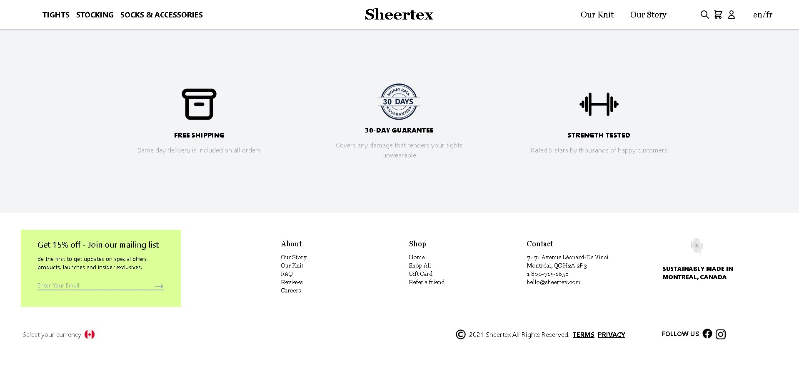
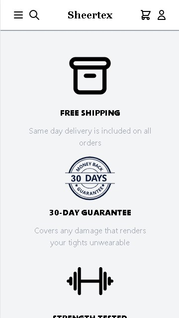
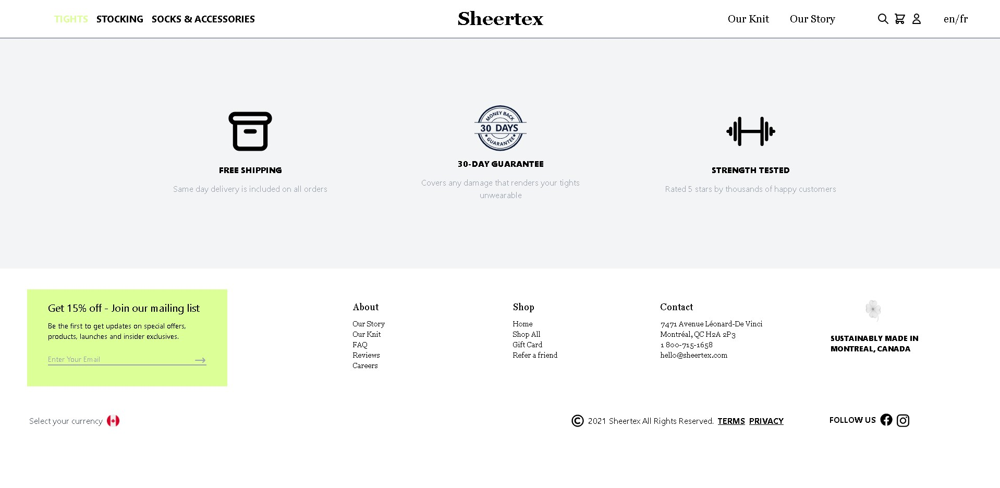

## Installations

Before Installation, ensure that you have the following installed in the latest versions:

- Node.js
- NPM

1. `npm init -y`

2. `npm i`

3. `npm run dev`

Open [http://localhost:3000](http://localhost:3000) with your browser to see the result.

## Technologies used

- Next.js
- Tailwind

## Desktop view

## Mobile View

  

    
    
    
  

## Hover Effect

Some categories (i.e. Tights, Stockings, etc) have hover effects.

### Duration

Time Spent: Approx. 10 hours (3 hours to learn tailwind, 7 hours on formatting and setting up website in next.js)
